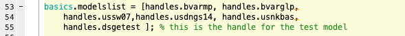
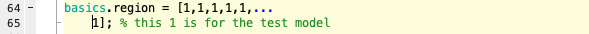
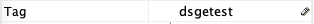
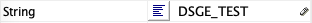

## Adding DSGE models

The Dynare mod-files of the DSGE models are stored in the folder named `MODELS`.

To include your own DSGE model into the forecast platform, you have multiple options. If you merely wish to include your forecast into the forecast chart for comparison purpose, please consider only add the model forecast but not the model into the Platform. The details of adding model forecasts are described [here](output.md#include_forecast).

If otherwise you wish to take the full advantage of the Platform, you may follow the steps below.

As of now, only DSGE models written as Dynare mod-file can be added, and only models estimated based on (the complete set or a subset of) the [eight observables listed in the introduction](index.md#observables) can be included in the Platform.

The Dynare names of these eight observables are in the Excel spreadsheet `List_Observables_US.xls` in the `EstimationInterface` folder. Please make sure that in your mod-file you have established some relationships between the observables in your model with these eight observables. 

Please make sure the following steps are strictly followed to include your model in the Platform:
 
### Step 1: Copy your mod-file

Create a subfolder in the `MODEL` folder to store your model. Make sure that all letters in the name of this subfolder are capitalized (e.g., `DSGE_TEST`).

Copy your mod-file and necessary functions (e.g., the m-file for computing the steady state) into this subfolder, and make sure that the mod-file has the same name as the folder name (e.g., `DSGE_TEST.mod`).

Comment out any estimation commands in the mod-file.

Declare the eight observables as varobs in your mod-file and link these observables to your own observation equations.

### Step 2: Edit `EstimationInterface.m`

Find the m-file `EstimationInterface.m` that is stored in the `EstimationInterface` folder, and open it up in the Matlab editer.

Add your model to the model handle list as other models in Line 53-55 in `basics.modelslist`. This will link the graphical user interface to your model folder and mod-file.

Add the name of the model into the list of model names as other models in Line 57-62 in `basics.models`. This will help Matlab recognize your model.

Declare the region of your model as other models in Line 64-65 in `basics.region`: 1 for US model, and 2 for Euro-Area models

!!! Note
	For now only US data is available, so please to declare your model region as **1**

Add an indicator vector in the matrix `basics.model_observables` that links observables to your model: for each observables, input 1 if it is used in your mod-file and input 0 if not. This vector shall be added in Line 80-85 in the m-file.

Save and close this m-file.

### Step 3: Edit `EstimationInterface.fig`

Open up the graphical interface `EstimationInterface.fig` in the Matlab GUIDE editor, which is also in the `EstimationInterface` folder.

Copy one of the model checkboxes from the `MODELS` block and paste it inside this block.

Open the properties of your checkbox, and change the `tag` property to match the handle name you gave in the `basics.modelslist`.

Change the `string` property of your checkbox to the name of your model.

Copy the `callback` property from another model checkbox, and paste it into the callback property of your checkbox.

Save and close this graphical interface.

Now you should be able to estimation your model using the data in the platform, and compare its forecast performance with the performances of other models.
