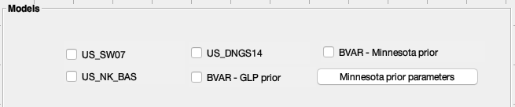
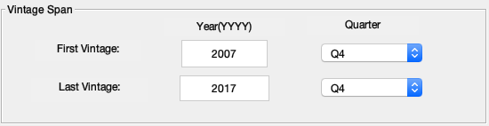
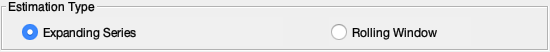
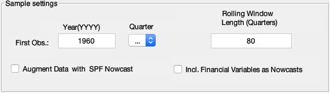

## Using the platform

The Matlab m-file `ForecastPlatform.m` is the main file which has to be run when using the platform. To run this file, you can either open the file in Matlab editor and click the `Run` button, or you can navigate the current directory to the path for the platform folder, and type `ForecastPlatform` in the Matlab command window and press the Enter button. After running the m-file, a graphical user interface of the platform will appear. 

Before running the platform, please clean the workplace using the Matlab command `clear all`, otherwise an unexpected error could be raised during the execution of the program.

!!! Note
	To make sure that all the relevant options will be correctly set up, it is instrumental to follow top-down and left-right fashion in the selection of options in the platform.

### Step 1: Selecting a model in the `Models` block

The block on the top left corner shows the models to estimate. There are three estimable DSGE models for the US economy started with ‘US’, and two Bayesian-VAR models started with ‘BVAR’, for you to choose. Only one model can be chosen in one run.

### Step 2: Specifying estimation options in the `Estimation Methods` block

By choosing a DSGE model, further options in the lower left block will become available, in which you can choose an estimation method and specify hyper-parameters for the method you choose. Click on the first option to obtain mode estimation, and the settings submenu will grey out by default. Click on the second option to obtain Metropolis-Hastings (MH) estimation, and the submenu will be activated. In the submenu, you can change the length and number of the Markov chains, the percentage of burn-in samples, and the scale for acceptance rate for the Metropolis-Hasting algorithm.

By choosing the BVAR-Minnesota prior model, you have the opportunity to further specify hyper-parameters by inside the box `Minnesota prior parameters` at the end the of `Models` option.

By choosing the BVAR-GLP prior model, the hyper-parameters can no longer be adjusted because they are already optimally chosen by the algorithm.

The `Estimation Methods` block will remain grey out in the last two cases.

### Step 3: Choosing the data in the `Data` block

Having selected the model, the data must be chosen in the upper right `Data` block, in which you can change the vintage span, the data type, the estimation type and corresponding sample settings.

`Vintage Span`. This submenu sets the time span for the chosen vintages. If only one vintage is chosen, the platform will then estimate the model for that vintage only. If  multiple vintages are chosen, the platform will then estimate the model multiple times, one for each vintage selected. By default the only vintage selected is the fourth quarter of the year 2007. To run the estimation for the most recent vintage, please select 2017Q4, for both fields.

`Data Type`. This submenu features to two options. By choosing `Real-Time`, the estimation will be based on data available at the time when the data is generated. By choosing `Revised`, the platform will use the most recent revised data in the estimation.

`Estimation Type`. This submenu includes two options:

* Choosing `Expanding Series` will create you a data set, that starts at the first observation in the `Sample Settings` menu. Thus, by choosing this option, please also specify the starting point of the data in the `First Obs` in the submenu below. By default the first observation will be the first quarter of year 1960.

* Choosing `Rolling Windows` will result in fixed length samples, relative to the estimation vintage. By choosing this option, please also specify the window length in the `Rolling Window Length (Quarters)` in the submenu below. By default the length of the rolling window will be set at 80 quarters, or equivalently, 20 years.

!!! Note
	Due to data limitations, some vintages might be incomplete. To find a report on this, please consult in the Excel spreadsheet in the estimation interface folder.

`Sample Settings`. In this last submenu, you can additionally choose the option `Augment Data with SPF nowcast`, which enables you adding the current vintage of the SPF nowcast in the data. Choosing including SPF nowcast will extend the data on some observables for which SPF nowcast were available. The nowcast of other observables will generated automatically by Dynare.

!!! Note
	If you choose not to include SPF nowcast, the first forecast generated by the platform will be the nowcast.

### Step 4: Generating desired outcomes in the `Forecasts & Performances` block

The last block on the lower right enables you to select further options for on the outcomes you wish to generate. The length of the out-of-sample forecasts can be specified in the `Forecast Horizon`. The first forecast will be the nowcast, unless you conditioned the nowcast on the SPF projections. By default, each model forecasts up to four quarters, that is five horizons ahead.

Clicking on `Plot Forecasts`, you can select for which vintages the comparisons of the forecast should be plotted. The submenu `Forecast Chart - Vintages` enables you to select a subset of estimated forecasts to be plotted. Under the submenu `Plot Options`, you can choose whether to include the SPF projections, choose which forecasts to plot (mean or mode), and choose which forecast density to be included in the chart (only one can be chosen).

!!! Note
	Only one forecast density can be displayed in the forecast chart, and the forecast density will be generated only when you choose to estimate a BVAR models or a DSGE model with Metropolis-Hastings algorithm.

### Step 5: Run it!

After finishing the above specification, click `Continue` at the bottom to let the platform run.